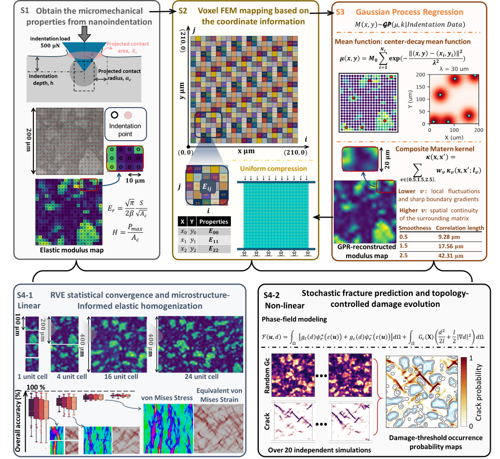

<h1 align="center">Predicting Stochastic Fracture in Hardened Alite Paste via a Microstructure-Informed Multiscale Reconstruction of Mechanical Fields</h1>

<h3 align="center">
  Muduo Li<sup>1</sup>, Xiaohong Zhu<sup>2,3,#</sup>, Ziqi Wang<sup>2,#</sup>, Xing Quan Wang<sup>4,5</sup>, Yan Zhuge<sup>6</sup>, Hailong Ye<sup>7</sup>, Xian Chen<sup>8</sup>, Daniel C.W. Tsang<sup>1,9,#</sup>
</h3>

<h4 align="center">
  <sup>1</sup>Department of Civil and Environmental Engineering, The Hong Kong University of Science and Technology, Clear Water Bay, Hong Kong, China<br>
  <sup>2</sup>Department of Civil and Environmental Engineering, University of California, Berkeley, California 94720, United States<br>
  <sup>3</sup>State Key Laboratory of Bridge Safety and Resilience, Beijing University of Technology, Beijing 100124, China<br>
  <sup>4</sup>Department of Mechanical Engineering, University of California, Berkeley, California 94720, United States<br>
  <sup>5</sup>School of Civil Engineering, The University of Sydney, Sydney, NSW, Australia<br>
  <sup>6</sup>UniSA STEM, University of South Australia, Adelaide 5000, Australia<br>
  <sup>7</sup>Department of Civil Engineering, The University of Hong Kong, Pokfulam, Hong Kong, China<br>
  <sup>8</sup>Department of Mechanical and Aerospace Engineering, Hong Kong University of Science and Technology, Hong Kong<br>
  <sup>9</sup>Research Center on Decarbonization Technology, The Hong Kong University of Science and Technology, Clear Water Bay, Hong Kong, China
</h4>

<p align="center"><strong>DOI:</strong> to be updated</p>

<p align="center">
  
</p>

## Abstract

Microscale heterogeneity and interfacial gradients fundamentally govern the deformation and fracture of cementitious materials, yet these features remain inadequately captured by conventional continuum mechanics. While nanoindentation provides direct access to local mechanical properties at the nanometer resolution, standard mean-field homogenization methods inherently neglect spatial correlations and fail to resolve non-linear fracture and damage evolution. Here, we develop a two-dimensional, microstructure-informed multiscale framework to reconstruct high-fidelity, continuous mechanical fields from sparse nanomechanical data. Central to this spatial reconstruction is Gaussian Process Regression (GPR), combining a center-decay mean function with a composite Matern kernel. This mechanistically motivated prior enables super-resolution field reconstruction, capturing sharp phase-boundary gradients and plausible sub-grid variations below the original indentation spacing. Using synthetic alite (impure tricalcium silicate), a complex multi-phase composite as a model system, we demonstrate that incorporating the proposed spatial model outperforms classical Voigt, Reuss, Mori-Tanaka, and Hashin-Shtrikman estimates, yielding a predicted macroscopic elastic modulus in 95.6% agreement with the average measurements from in-situ compression tests. By further integrating indentation-derived fracture-resistance fields into a phase-field formulation, the model reveals stochastic microcrack initiation and morphology-dictated failure pathways within the heterogeneous low-density C-S-H matrix. This framework offers a potentially transferable route to convert sparse micromechanical data into spatially continuous fields for predicting nonlinear damage in cementitious materials.

## Data

Raw Bruker TI 980 nanoindentation files are provided in `data/raw/ti980_hys/`.
The checksum manifest is `data/raw/ti980_hys_manifest.csv`.

The code expects CSV files with these columns:

```text
indentation grid:      x_um,y_um,E_GPa
voxel material table:  element_id,x_um,y_um,E_GPa,nu
```

GPR is implemented with GPyTorch. The default kernel is the three-component
Matern covariance used in the paper; a single RBF kernel is also available for
training.

## Install

```bash
conda env create -f environment.yml
conda activate microstructure-informed-mechanical-fields
pip install -e .
```

## Examples

Abaqus material assignment:

```bash
python examples/abaqus/assign_voxel_materials.py --csv path/to/voxel_material_table.csv --dry-run
```

FEniCSx/dolfinx linear elasticity:

```bash
python examples/fenicsx_linear_elasticity/linear_elastic_voxel_demo.py --csv path/to/voxel_material_table.csv --nx 100 --ny 100
```

## Citation

DOI and full citation will be added after publication metadata are finalized.

## License

Code is released under the MIT License. Raw data are released under CC BY 4.0.
